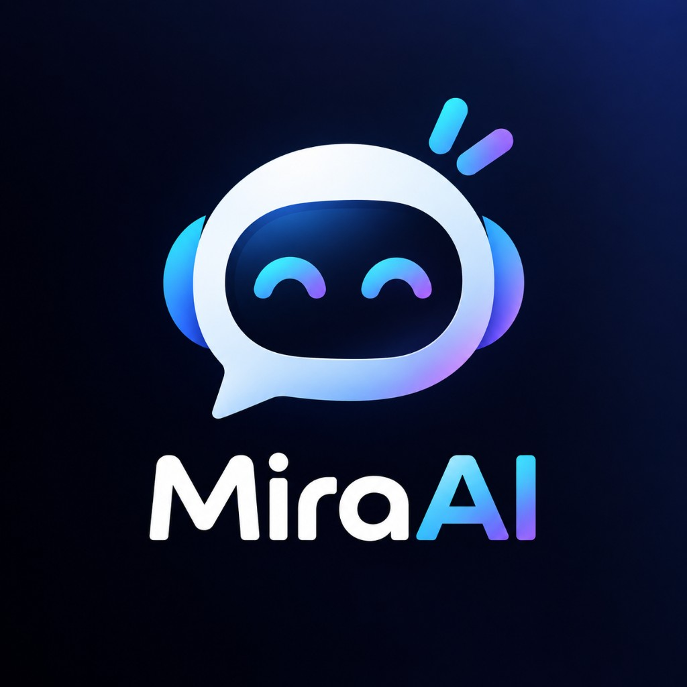

# Mira AI Agent

一个支持多模型（Alpha / Beta / Gamma）+ AI 客服（Guide）的对话系统。

## ✨ Features

- 多模型切换（Alpha / Beta / Gamma / Guide）
- AI 客服推荐系统（Guide）
- 动态 Starter + 推进链
- 语音输入 / TTS 播报
- 本地会话管理（Sidebar）

## 🛠 Tech Stack

- Next.js 16
- TypeScript
- Tailwind CSS
- Prisma + SQLite
- DeepSeek API（OpenAI SDK 兼容）

## 🚀 Getting Started

```bash
npm install
npx prisma migrate deploy
npm run db:seed
npm run dev
```

创建 `.env.local`（或复制 `.env.example`）：

```bash
# Windows PowerShell
Copy-Item .env.example .env.local
```

至少填入：

```env
OPENAI_API_KEY=your_key_here
SESSION_SECRET=your_random_secret_here
```

语音功能（可选）还需配置 `VOLC_APP_ID` 与 `VOLC_API_KEY`，**切勿写入仓库**。

打开 [http://localhost:3000](http://localhost:3000)。

## 🧪 Preview



## 📦 项目结构

```
/app/chat          聊天核心
/components/chat   UI 组件
/lib               业务逻辑（chain / voice / stream）
```

## 🔒 安全说明

以下内容已通过 `.gitignore` 排除，**请勿提交**：

| 文件 | 说明 |
|------|------|
| `.env` / `.env.local` | API Key、会话密钥 |
| `*.db` / `data.db` | SQLite 本地数据（含用户与对话） |
| `node_modules` / `.next` | 依赖与构建产物 |

请仅使用 `.env.example` 作为配置模板，保留 key、不填真实值。

## 📌 状态

当前版本：**v1.0**（已可用）
